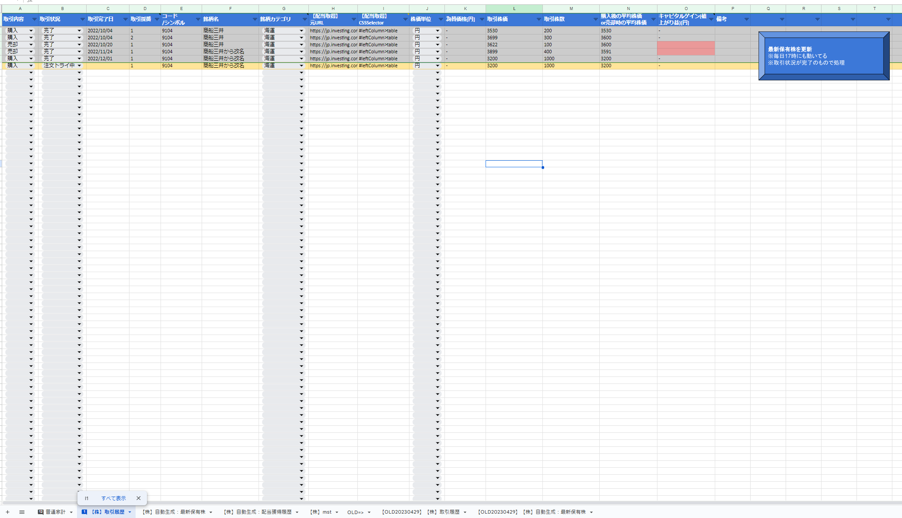
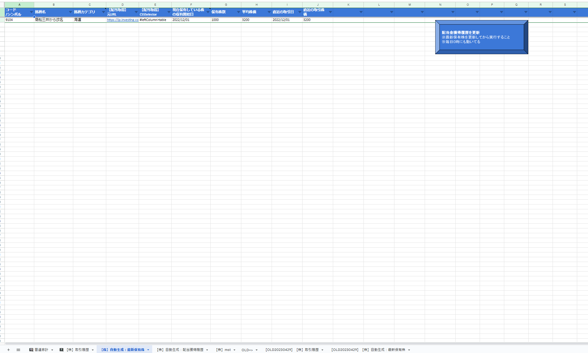
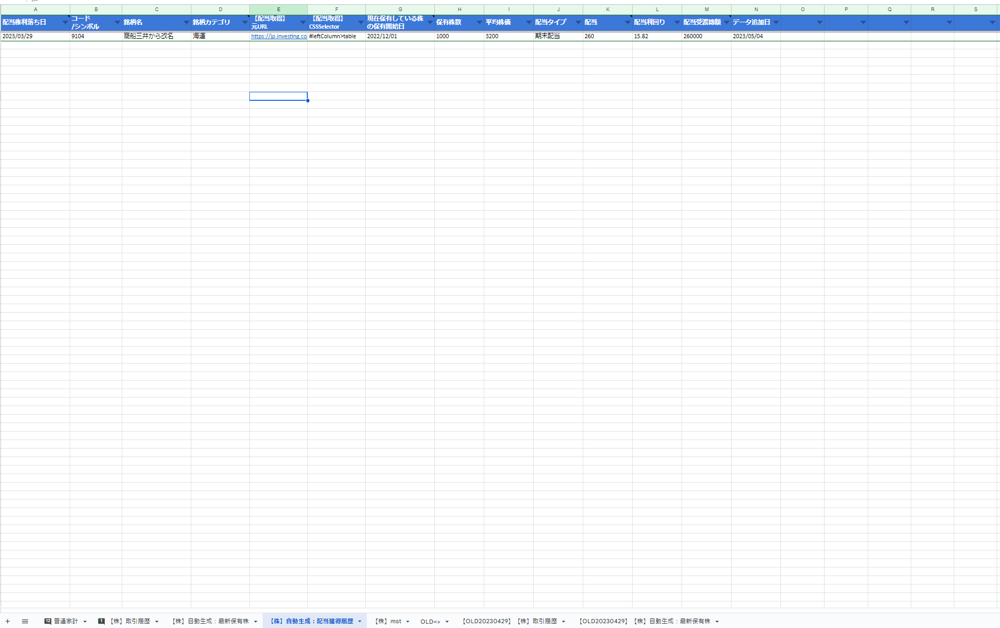

# gas_stocktradehist2exrighthist
株取引履歴シートから配当獲得履歴を自動で(日次)導出するGAS．

### 準備
1. GASに`最新保有株.gs`と`配当獲得履歴.gs`を作成してコピペ
1. ライブラリ`HtmlParser`(ID: 1JTLPVXGW6Pq4zSAV5ED9XrWOPydVywumQZSOWN7l6KJ0UtWxtX3RbYO6)をGASに登録
1. シート`【株】取引履歴`の作成
    
    1. ヘッダを1行目に作成
        - カラム順を変えてもOK．コードはそれに対応してる
    1. 適宜条件付き書式を設定
        - 「取引状況＝完了」でグレー背景にするとか
        - 「取引状況＝完了」だが未入力の列を赤背景にするとか
    1. 「最新保有株を更新」ボタンを作り，`最新保有株.updateStocksHolding`のスクリプトを割り当てる
1. シート`【株】自動生成：最新保有株`の作成
    
    1. ヘッダを1行目に作成
        - カラム順を変えてもOK．コードはそれに対応してる
    1. 「配当獲得履歴を更新」ボタンを作り，`配当獲得履歴.appendDividendHist`のスクリプトを割り当てる
1. シート`【株】自動生成：配当獲得履歴`の作成
    
    1. ヘッダを1行目に作成
        - カラム順を変えてもOK．コードはそれに対応してる
1. GASのトリガーで下記2つを登録
    - `最新保有株.updateStocksHolding`: 毎日17～18時実行
    - `配当獲得履歴.appendDividendHist`: 毎日23～24時実行

### 使い方
1. `【株】取引履歴`に手入力
    - カラム「【配当取得】元URL」とカラム「【配当取得】CSSSelector」は，基本下記のWebページを基に設定する．
        - [investing.comの配当ページ例](https://jp.investing.com/equities/mitsui-o.s.k.-lines,-ltd.-dividends)
        - カラム「【配当取得】CSSSelector」は上記Webページにある配当の表のtableタグを指すCSSセレクタをコピペする
1. 「最新保有株を更新」ボタンを押してシート`【株】自動生成：最新保有株`を更新
    - 毎日実行のトリガーに任せてもいい
1. 「配当獲得履歴を更新」ボタンを押してシート`【株】自動生成：配当獲得履歴`を更新
    - 毎日実行のトリガーに任せてもいい
